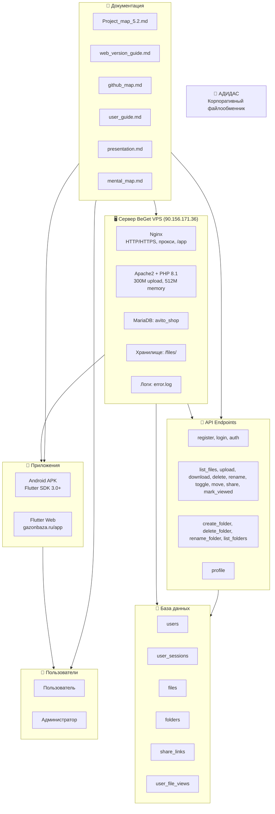

# 🧠 Ментальная карта проекта АДИДАС

```mermaid
graph TB
    ROOT["🏢 АДИДАС<br>Корпоративный файлообменник"]
    
    subgraph SERVER["🖥️ Сервер BeGet VPS (90.156.171.36)"]
        NGINX["Nginx<br>HTTP/HTTPS, прокси, /app"]
        APACHE["Apache2 + PHP 8.1<br>300M upload, 512M memory"]
        MARIADB["MariaDB: avito_shop"]
        STORAGE["Хранилище: /files/"]
        LOGS["Логи: error.log"]
    end

    subgraph APPS["📱 Приложения"]
        ANDROID["Android APK<br>Flutter SDK 3.0+"]
        WEB["Flutter Web<br>gazonbaza.ru/app"]
    end

    subgraph DB["💾 База данных"]
        USERS["users"]
        SESSIONS["user_sessions"]
        FILES["files"]
        FOLDERS["folders"]
        SHARE["share_links"]
        VIEWS["user_file_views"]
    end

    subgraph API["📡 API Endpoints"]
        AUTH_API["register, login, auth"]
        FILE_API["list_files, upload, download, delete, rename, toggle, move, share, mark_viewed"]
        FOLDER_API["create_folder, delete_folder, rename_folder, list_folders"]
        PROFILE_API["profile"]
    end

    subgraph USERS_ROLES["👥 Пользователи"]
        USER["Пользователь"]
        ADMIN["Администратор"]
    end

    subgraph DOCS["📄 Документация"]
        DOC1["Project_map_5.2.md"]
        DOC2["web_version_guide.md"]
        DOC3["github_map.md"]
        DOC4["user_guide.md"]
        DOC5["presentation.md"]
        DOC6["mental_map.md"]
    end

    SERVER --> APPS
    SERVER --> DB
    SERVER --> API
    APPS --> USERS_ROLES
    API --> DB
    DOCS --> SERVER
    DOCS --> APPS
    DOCS --> API
    DOCS --> USERS_ROLES
```